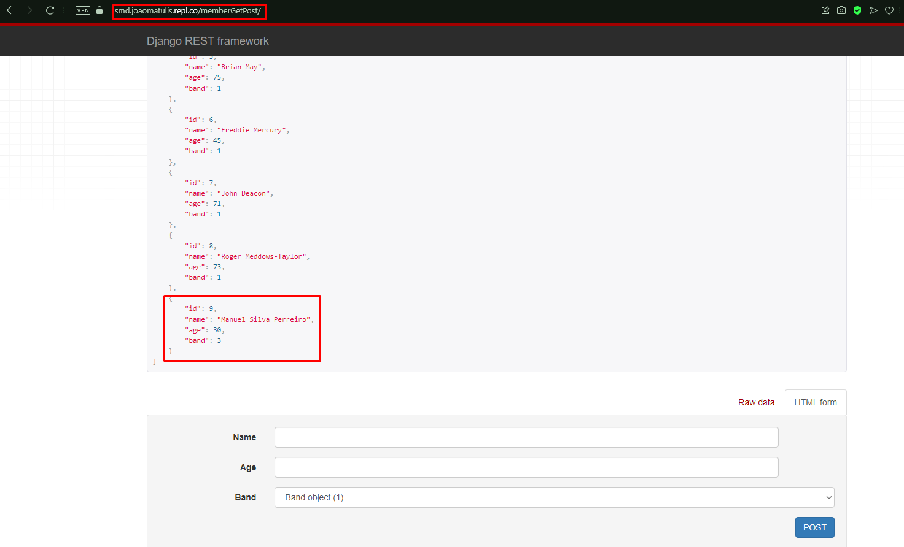

# Projeto Sistemas Móveis Distribuídos - Turma A
#### Django Rest: Album de Música

### Integrantes do Grupo
- Arthur Dourado da Silva - Id de aluno: 1142500663
- Bernardo Galvão de Souza - Id de aluno: 1142473154
- Gabriel de Melo Silva - Id de aluno: 1141267353
- João Victor Matulis - Id de aluno: 1142445416
- Kevin de Sousa dos Santos - Id de aluno: 1142168549

# Ligar o Django para usar a API

Para poder usar essa API Django é necessário verificar se o projeto está sendo rodado no site Replit usando o link: https://replit.com/@joaomatulis/SMD
 
A tela que você vai ver provavelmente vai ser essa:
 
 

 
 
Para iniciar o programa clique em algum dos botões destacados abaixo:
 
 

 
 
Após isso você deve ver essa tela:
 
 

 
 
Caso sua tela esteja assim você pode prosseguir para as próximas etapas do documento

# Métodos Get e Post
### - Banda : https://smd.joaomatulis.repl.co/bandGetPost/
### - Álbum : https://smd.joaomatulis.repl.co/albumGetPost/
### - Música : https://smd.joaomatulis.repl.co/musicaGetPost/
### - Membros : https://smd.joaomatulis.repl.co/memberGetPost/

# Métodos Delete e Update

### - Banda : https://smd.joaomatulis.repl.co/bandDeleteUpdate/(id da banda)
### - Álbum : https://smd.joaomatulis.repl.co/albumDeleteUpdate/(id do álbum)
### - Música : https://smd.joaomatulis.repl.co/musicaDeleteUpdate/(id da música)
### - Membros : https://smd.joaomatulis.repl.co/memberDeleteUpdate/(id do membro)

# Acessar e Cadastrar uma Banda  
Primeiro é necessário registrar no banco de dados uma Banda, usando
 
o método ***POST*** usando o link: https://smd.joaomatulis.repl.co/bandGetPost/
 
Exemplo:
 
 

 
 
Se tudo estiver ocorrido como esperado você verá essa tela:
 
 

 
 
Exibindo o nome da banda que acabou de ser cadastrada e seu id
 
Caso queira ver todas as bandas cadastradas clique no botão ***GET*** mostrado na foto abaixo ou acesse o link novamente:
 
 

 
 
Fazendo assim retornando para a tela inicial e mostrando todas as bandas cadastradas
 
 

 
 

# Acessar e Cadastrar um Álbum  
Agora que temos uma banda cadastrada podemos cadastra um álbum para essa banda e seus membros
 
Vamos Cadastrar primeiro um álbum para essa banda, usando o link: https://smd.joaomatulis.repl.co/albumGetPost/
 
(Você pode escolher a ordem do que inserir primeiro, se vai inserir primeiro os membros antes dos álbuns, vai conforme sua vontade)
 
 
Para cadastrar um álbum é necéssario inserir o nome do álbum, a data que ele foi ou vai ser lançado, e escolher a qual banda ele pertence
 
(Para saber qual banda é qual, é necessario voltar no método ***GET*** banda e ver qual é o Id da banda escolhida)
 
 
Exemplo:
 
 

 
 
Tela informando que o Álbum foi inserido no banco de dados
 
 

 
 
Para ver todos os álbuns cadastrados é só fazer igual fizemos na banda, é só acessar o link novamente ou clicar no botão ***GET***
 
 

 
 

 
 
Para cadastrar músicas é só seguir os mesmo passos que fizemos para cadastrar e acessar as bandas e os álbuns acima, só que usando o link: https://smd.joaomatulis.repl.co/musicaGetPost/
 
E para cadastrar os membros das bandas é só seguir os mesmo passos acima, só que usando o link: https://smd.joaomatulis.repl.co/memberGetPost/
 

# Atualizar um dado
Nesse exemplo vamos Atualizar uma música cadastrada no banco de dados
 
Para isso a gente precisa pegar o id da música que precisamos atualizar, usando o link: https://smd.joaomatulis.repl.co/musicaGetPost/
 
Para esse exemplo vamos utilizar a música de id: 26, e vamos arrumar o título da música:
 
 

 
 
Agora que temos o id da música vamos acessar o método de atulizar, apartir do link: https://smd.joaomatulis.repl.co/musicaDeleteUpdate/26
 
Lembrando que no final do url é necessário inserir o id ao qual você vai editar, no link acima eu coloquei no final o número 26, pois irei editar a música de id 26
 
Acessando o link com o id correto você deve ver a seguinte tela:
 
 

 
 
Nessa tela é possível ver os dados que estão guardados no id informado e ver qual informação eu quero alterar
 
Para alterar os dados dessa música basta alterar os campos desejados e clicar em ***PUT***
 
Nesse caso eu quero só alterar o nome da música para ***A Taste of Honey***
 
 

 
 
Assim que clicar em ***PUT*** a página será recarregada mostrando os novos dados
 
 

 
 

# Remover um Dado
Nesse Exemplo iremos remover um membro cadastrado no banco de dados
 
Para isso a gente precisa pegar o id do membro que precisamos remover, usando o link: https://smd.joaomatulis.repl.co/memberGetPost/
 
Para esse exemplo vamos remover o membro Manuel Silva Perreiro de id 9:
 
 

 
 
Agora acessamos o link: https://smd.joaomatulis.repl.co/memberDeleteUpdate/9
 
Lembrando que o 9 no final do link é o id do membro que acabamos de pegar
 
 

 
 
Agora para deletar esse membro só é necessário clicar no botão ***DELETE*** e confirmar a remoção do membro
 
 

 
 

 
 
Caso confirme o membro será removido do banco de dados e a tela ficará assim:
 
 

 
 
Mostrando que no id 9 tem nenhum dado cadastrado